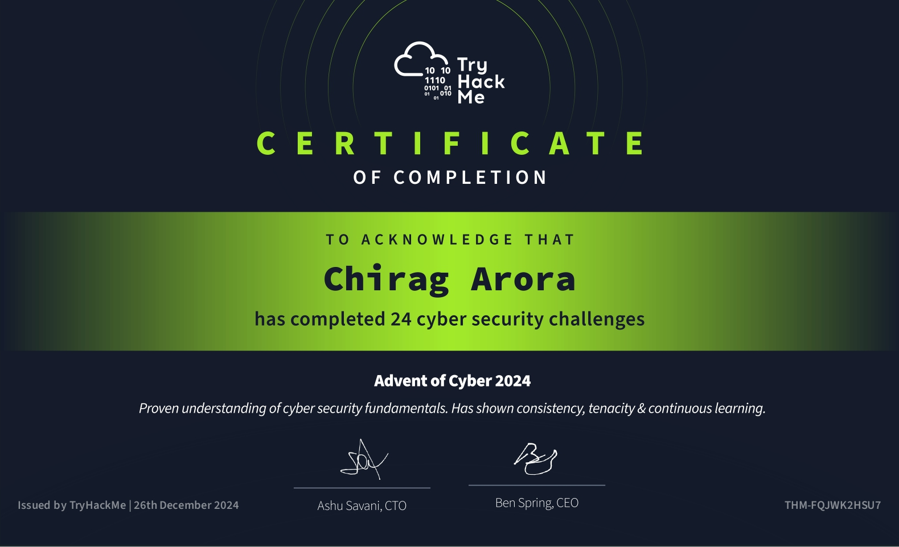

<table border=5><tr><th colspan=2>
  
# Advent Of Cyber 2024 🎄
Just few notes from the challenges

</th></tr><tr><th>Day</th><th>Challenge</th></tr>
<tr><th>1.</th><td>

## OPSEC ( Purple Teaming )
- Downloaded file from YouTube-to-MP3 .
- Run `file` command and uncover a Windows shortcut.
- Look at it's metadata with `Exiftool`.
- In it we found a PowerShell command downloading a remote script.
- A unique code signature in the script help us to track the person on GitHub and revealed the attacker's identity. 
```
Commands & Tools Used : Find, Exiftool, Github.
```
<br>
</td></tr>

<tr><th>2.</th><td>
  
## Log Analysis ( Blue Teaming )
- Start looking into security logs of different timestamps in Elastic SIEM.
- Found some encoded PowerShell commands running.
- There found an encoded PowerShell command executed on compromised systems.
- Decode it with CyberChef, it was just a update command.
```
Commands & Tools Used : Elastic SIEM, CyberChef.
```
<br>
</td></tr>

<tr><th>3.</th><td>


## Log Analysis ( Purple Teaming )
- In Kibana we look at some logs of `frostypines`. After adjusting few filter we found some trace (path and unusual ip) of web shell.
- Then because of weak/default credentials we able to logged in as admin on that website.
- Then we find that same file upload vulnearability in the image upload where we uploaded a php file that execute commands on server.
```
Commands & Tools Used :  ELK (Elasticsearch, Logstash, and Kibana), ls, cat.
```
<br>
</td></tr>

<tr><th>4.</th><td>

## Atomic Red Team ( Purple Teaming )
- Recreated MITRE ATT&CK technique `T1566.001 Spearphishing` using the Atomic Red Team library. 
- Looked into Sysmon logs for emulated attack, found a PowerShell command creating a file.
- Found technique for `a command and scripting interpreter on Windows command shell`.
- Now for technique `T1059.003 Command and Scripting Interpreter: Windows Command Shell` we iterate through each test until a file is created and we found our flag.
```
Commands & Tools Used : Atomic Red Team Library, Sysmon.
```
<br>
</td></tr>

<tr><th>5.</th><td>

## XXE ( Red Teaming )
- On a wishlist website first we found a page `/wishes/wish_1.txt` that possibly admins use to see different wishes submited by users.
- Then we used the `BurpSuite` to found that wish is submitted as XML to `/wishlist.php`.
- XXE(XML external entity) might be present here so we put `<!DOCTYPE foo [<!ENTITY payload SYSTEM "/var/www/html/wishes/wish_1.txt"> ]>` as external entity and `&payload;` in XML request & get access to admin only data.
```
Commands & Tools Used : Burp Suite.
```
<br>
</td></tr>

<tr><th>6.</th><td>

## Sandboxes ( Blue Teaming )
- In a VM we run YARA rules to detect malware.
- After detection, we use a obfuscated version which used encoded PowerShell commands, but it remained identifiable through FLOSS and Sysmon logs.
```
Commands & Tools Used : YARA, Sysmon, CyberChef, FLOSS.
```
<br>
</td></tr>

<tr><th>7.</th><td>

## AWS Log Analysis ( Blue Teaming )
- Analyzed Amazon CloudTrail and RDS logs using `jq` and `grep` with different filters to identify the individual responsible for modifying the QR code on the donation website.
```
Commands & Tools Used : JQ, grep.
```
<br>
</td></tr>

<tr><th>8.</th><td>

## Shellcodes ( Purple Teaming )
- Used msfvenom, we generate a shellcode.
- We put the shellcode into memory using a powershell script to establish a reverse shell.
```
Commands & Tools Used : msfvenom, nc.
```
<br>
</td></tr>

<tr><th>9.</th><td>

## GRC ( Blue Teaming )
- Performed Risk Assessments based on the questions answerd by different vendors to choose the one with lowest risk.

<br>
</td></tr>

<tr><th>10.</th><td>

## Phishing ( Red Teaming )
- Used `Metasploit Framework` to create a malicious macro.
- Sent it through familiar looking email.
- We were using `Metasploit Framework` to listen to incoming connection.
- When the macro file opend we got reverse shell to the target system.
```
Commands & Tools Used : Metasploit Framework.
```
<br>
</td></tr>

<tr><th>11.</th><td>

## Wi-Fi attacks ( Red Teaming )
- With `iw` set our wifi into monitor mode.
- Used `airodump-ng` to scan for nearby networks.
- Sent deauth packets to specific BSSID then capture the 4 way handshake into a file.
- Run dictionary attack on the captured handshake file using `aircrack-ng` to get the password.
```
Commands & Tools Used : iw, airodump-ng, aircrack-ng, aireplay-ng.
```
<br>
</td></tr>

<tr><th>12.</th><td>

## Web timing attacks ( Red Teaming )
- A website with possibility of `Time-of-Check to Time-of-Use (TOCTOU)` flaw, we intercepted money transfer request in Burp Suite. 
- Duplicate it in Repeater and sending multiple simultaneous requests using last-byte sync to exploit the race condition & successfully transfer more money than account's total balance.
```
Commands & Tools Used : Burp Suite.
```
<br>
</td></tr>

<tr><th>13.</th><td>

## Websockets ( Red Teaming )
- Intercept the WebSocket traffic of a car tracking website with `BurpSuite`.
- Manipulate the `userId` of WebSocket messages to track other's car.
- Changed same parameter for chat traffic to send message in live chat as different user.
```
Commands & Tools Used : Burp Suite.
```
<br>
</td></tr>

<tr><th>14.</th><td>

## Certificate mismanagement ( Red Teaming )
- First we did `local dns resolution` using `/etc/hosts` file to avoid trace in dns logs.
- Used burpsuite as intermidiate proxy to listen to http traffic and get user credentials of a website using self-signed certificates.
```
Commands & Tools Used : Burp Suite.
```
<br>
</td></tr>

<tr><th>15.</th><td>

## Active Directory ( Blue Teaming )
- With a suspected breach of Active Directory, analyzed user logins and activities, reviewed PowerShell history, and identified maliciously installed GPOs `(Group Policy Objects)`.
```
Commands & Tools Used : Windows Event Viewer.
```
<br>
</td></tr>
<tr><th>16.</th><td>

## Azure ( Red Teaming )
- Used Azure CLI to identify suspicious users, track their activities.
- Examined group memberships, check for suspicious groups.
- Check for assigned roles and access permissions.
```
Commands & Tools Used : Azure CLI.
```
<br>
</td></tr>
<tr><th>17.</th><td>

## Log analysis ( Blue Teaming )
- Used Splunk to view CCTV logs and web logs.
- Extracted custom fields, parsed the logs with regular expressions.
- Correlated the session IDs and IP addresses to identify the attacker.
```
Commands & Tools Used : Splunk.
```
<br>
</td></tr>
<tr><th>18.</th><td>

## Prompt injection ( Red Teaming )
- In AI-powered chatbot we check how it communicate with system using it's APIs and then performed prompt injection.
- Here through blind remote code execution (RCE) we achieved a reverse shell of target system.
```
Commands & Tools Used : tcpdump, netcat.
```
<br>
</td></tr>
<tr><th>19.</th><td>

## Game Hacking ( Red Teaming )
- Used Frida to intercept function calls. 
- Accessed the in-game OTP.
- Altered in-game values to purchasing items for free.
- Passed the biometric check by altering the returning value from library function.
```
Commands & Tools Used : Frida, Vscode.
```
<br>
</td></tr>
<tr><th>20.</th><td>

## Traffic analysis ( Blue Teaming )
- Analyzed a PCAP file using Wireshark.
- Found a C2 server communication between multiple threat actors and their activities.
- Decrypted the secret messages using CyberChef.
```
Commands & Tools Used : Wireshark, CyberChef.
```
<br>
</td></tr>
<tr><th>21.</th><td>

## Reverse engineering ( Blue Teaming )
- Reverse engineering a suspicious .NET binary, `WarevilleApp.exe`, using PEStudio for static analysis and ILSpy for decompiling to reveal its malicious functionality.
- Figured the behaviour of malware which involved downloading and executing files, creating a zip file of victim data, and interacting with a C2 server.
```
Commands & Tools Used : PEStudio, ILSpy.
```
<br>
</td></tr>
<tr><th>22.</th><td>

## Kubernetes DFIR ( Blue Teaming )
- Looked at some `Kubernetes` pod logs of compromised web application.
- Identified a suspisious file `shelly.php` access from an unexpected IP. The webshell was present even after reboot so it was part of the docker image itself.
- So we check the docker registry logs, we found same unexpected IP and other IP, and trace of PATCH the docker images in registry which have that `shelly.php` which is a web shell.
- In the Kubernetes roles we found an unexpected role with a permission to do this kind of thing, with this we figure the attack path or activities of the user.
```
Commands & Tools Used : minikube, kubectl, docker.
```
<br>
</td></tr>
<tr><th>23.</th><td>

## Hash cracking ( Red Teaming )
- With `hash-id.py` identified a hash type of a password hash.
- Cracked it with John the Ripper using the `rockyou.txt` wordlist.
- We got a pdf with password so converted the file to a hash format with `pdf2john.pl`.
- Created a custom wordlist with possible password and run John the  Ripper with `--rules=single` option, cracked the PDF password.
```
Commands & Tools Used : John The Ripepr, hash-id.py, pdf2john.pl.
```
<br>
</td></tr>
<tr><th>24.</th><td>

## Communication protocols ( Blue Teaming )
- Analyzed `MQTT (Message Queuing Telemetry Transport)` traffic using Wireshark, examined captured packets in  file `challenge.pcapng` to get the correct message which would turn on the lights.
- Used the `mosquitto_pub` to publish the correct message to the devices which turn the lights on.
```
Commands & Tools Used : Wireshark, mosquitto_pub.
```
<br>
</td></tr>

</table>

<table border=4>
  <tr><th>
    
     Advent Of Cyber'24 Certificate (Don't mind it, it's just a decorative. Real value is above 👆🏻 👴🏻)
  
  </th></tr>
  <tr><th>
  
  

</th></tr></table>
